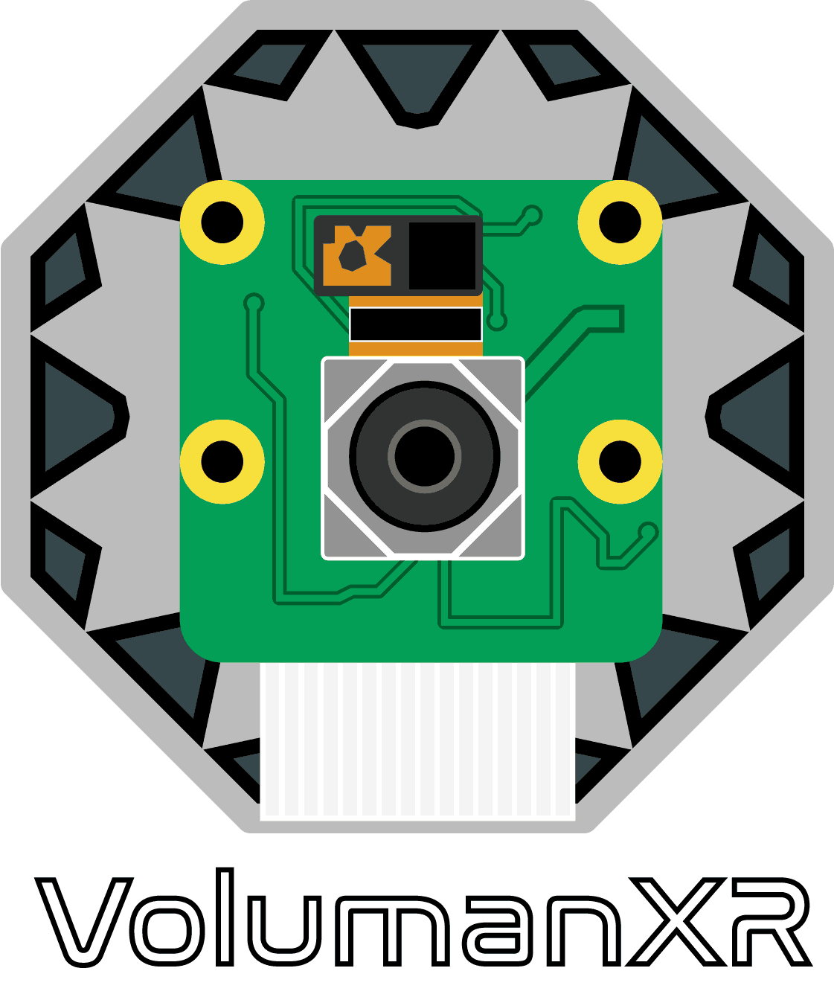

[EN](../profile/README.md) | **DE**

<p align="center">
  
</p>

# VolumanXR

**Eine End-to-End-Pipeline für volumetrische Erfassung und 4D-Gaussian-Darstellung**

Willkommen in der **VolumanXR GitHub-Organisation**, die die Repositories eines gemeinsamen Forschungsprojekts an der TH Köln im Rahmen des Masterstudiengangs Medientechnologie beherbergt. VolumanXR stellt ein modulares Ökosystem zur Erfassung, zum Training und zur Darstellung hochwertiger dynamischer menschlicher Repräsentationen auf Basis moderner 4D-Gaussian-Splatting-Verfahren bereit, mit XR-Integration für Meta-Quest-Geräte.

Jedes Teilteam pflegt ein eigenes Repository innerhalb dieser Organisation, die gemeinsam eine vollständige End-to-End-Pipeline bilden.

> **Wartungshinweis**\
>Diese GitHub-Organisation dient primär als Dokumentations- und Referenzplattform für das VolumanXR-Forschungsprojekt. Weiterentwicklungen erfolgen nur gelegentlich und nicht kontinuierlich. Repositories können sporadisch aktualisiert werden, eine regelmäßige Pflege oder langfristiger Support ist nicht vorgesehen.

## 🧠 Projektumfang

VolumanXR bietet ein skalierbares und reproduzierbares End-to-End-System mit folgenden Fähigkeiten:

- Synchronisierte Multiview-Videoaufnahme mittels eines maßgeschneiderten volumetrischen Kamera-Rigs
- Datenverarbeitung und Training zu dynamischen 4D-Gaussian-Repräsentationen
- Echtzeit-Visualisierung in einer immersiven XR-Umgebung
- Erweiterte Avatardarstellung durch HAC-Gaussians

## 🗂 Organisationsstruktur
Die VolumanXR-Organisation besteht aus mehreren Repositories, die jeweils von dedizierten Teilteams betreut werden. Aktuell ist nur das Capture-System öffentlich zugänglich:
```text
VolumanXR (GitHub-Organisation)
├── docs/                       # Gemeinsame Projektdokumentation und Assets
│   ├── assets/                 # Logos und geteilte Ressourcen für Doku und README
│   └── publications/           # Dokumentation und Veröffentlichungen
├── volumetric-capture-system/  # Multikamera-Rig Hardware & Software (Raspberry Pi-basiert)
├── training/                   # Preprocessing und Training von Spacetime Gaussians
├── viewer/                     # WebXR/WebGPU-basierter Viewer für XR-Echtzeitdarstellung
├── hac-gaussian/               # Experimentelle Forschung zu animierbaren Gaussian-Avataren
└── .github/README.md           # Organisations-README                    <-- Du bist hier :)
```

Jedes Repository enthält eine eigene `README.md` mit technischen Details, Setup-Anleitungen und nutzungsspezifischer Dokumentation.

## 🔍 Teilprojekte im Überblick

### [**Volumetric Capture System**](https://github.com/VolumanXR/volumetric-capture-system) (öffentliches Repository)
Konstruktion und Steuerung des Kamera-Rigs (68 Raspberry Pis + Kameras):

- WLAN-Synchronisation und Fernsteuerung
- GUI zur zentralen Aufnahmeverwaltung
- Automatisierte Kalibrierung und Session-Management

### **Training Pipeline** (nur intern)
Pipeline zur Verarbeitung und zum Training von 4D Spacetime Gaussians:

- COLMAP-basiertes Kamera-Tracking
- Hintergrund- und Feature-Entfernung
- Szenenoptimierung und Trainingsprozesse
- Generierung synthetischer Datensätze für Testzwecke

### **Viewer** (nur intern)
Ein eigens entwickelter WebXR/WebGPU-Viewer zur immersiven Wiedergabe gaußbasierter volumetrischer Inhalte in XR:

- Kompatibel mit Meta Quest VR-Brillen
- Interaktive Steuerung (Platzierung, Skalierung, Rotation)
- Sequenzübergänge und Glättung

### **HAC-Gaussian** (nur intern)
Experimentelle Arbeiten mit animierbaren Avataren auf Basis von 3D-Gaussian-Splatting:

- Animierbare Gaussians
- Mixed-Precision-Training
- Optimierungen für Echtzeitrendering

## 📄 Dokumentation

Der vollständige Projektbericht befindet sich unter [`docs/publications/Voluman_Documentation_DE.pdf`](../docs/publications/Voluman_Documentation_DE.pdf).  

Teile dieses Projekts wurden als [IEEE VR26-Poster](../docs/publications/IEEE_VR26_Poster.pdf) veröffentlicht, dass das Volumetric Capture System umfasst. Weitere Informationen finden Sie im entsprechenden Repository.

Projektweite Branding- und Grafikressourcen befinden sich unter `docs/assets/`.

## 👥 Projektteam

Dieses Projekt wurde von folgenden Teammitgliedern umgesetzt:

#### Volumetric Capture System
- [Kai Altwicker](https://github.com/tallAldi) (Stellv. Projektleitung)
- [Dennis Luca Amuser](https://github.com/dooonnis)

#### Training Pipeline
- [Matthias Bullert](https://github.com/DuesenDan)
- [David Mertens](https://github.com/DavidMertTH)

#### Viewer
- [David Martin Karg](https://github.com/EmptyBarrel)
- [Alisa Rüge](https://github.com/validP0)
- [Steffen Stein](https://github.com/forEachWhileTrue) (Project Lead)

#### HAC-Gaussian
- [Marvin Winkler](https://github.com/Knobelboy)

Besonderer Dank gilt dem Makerspace der TH Köln, Prof. Dr.-Ing. Arnulph Fuhrmann und der Förderung durch Kickstart@TH Köln.

## 📜 Lizenz

Dieses Projekt steht unter der MIT-Lizenz. Details siehe `LICENSE`.

---

> Für detaillierte Setup- oder Nutzungshinweise siehe die READMEs der jeweiligen Repositories.
